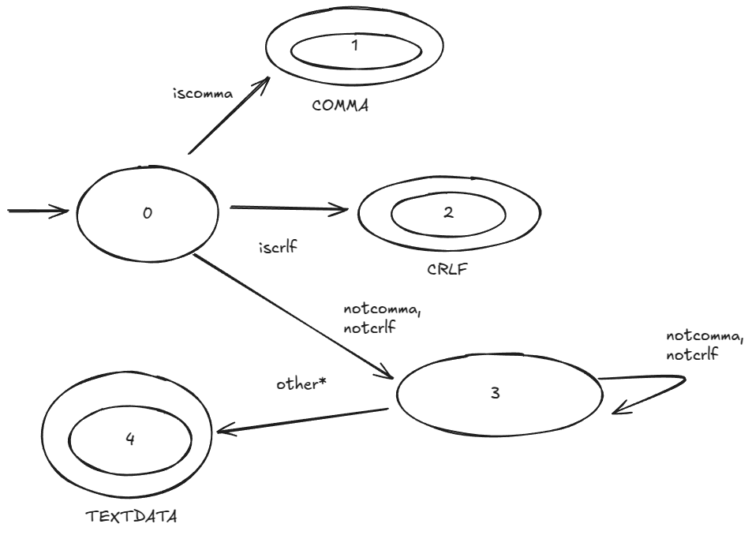

# Running

- Install .NET SDK

- Run `dotnet run file.csv`

## From RFC 4180:

The ABNF grammar [2] appears as follows:

file = [header CRLF] record *(CRLF record) [CRLF]

header = name *(COMMA name)

record = field *(COMMA field)

name = field

field = (escaped / non-escaped)

escaped = DQUOTE *(TEXTDATA / COMMA / CR / LF / 2DQUOTE) DQUOTE

non-escaped = *TEXTDATA

COMMA = %x2C

CR = %x0D ;as per section 6.1 of RFC 2234 [2]

## Simplified grammar:

file = [header CRLF] record *(CRLF record) [CRLF]

header = name *(COMMA name)

record = field *(COMMA field)

name = field

field = *TEXTDATA

COMMA = %x2C

CR = %x0D ;as per section 6.1 of RFC 2234 [2]

# Contributing

- [ ] Add Escaped field support
- [ ] Refactor getNextToken (it probably looks pretty bad): [Lexer.cs](./lexer/Lexer.cs)
- [ ] Better property access choices
- [ ] Better type naming
